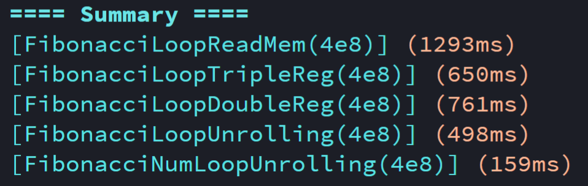
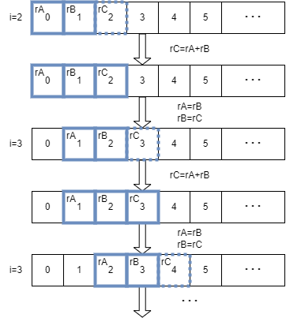
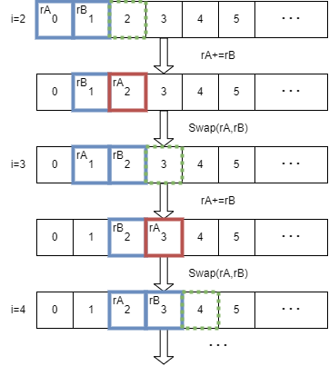
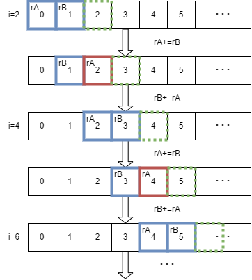

> 吾尝终日而码矣，不如须臾之所学也

## 概述

本文章是在解决一个实际问题时产生的，这个问题已经简单到熟透了——求斐波那契数，也就是：

$$
F(n)=
\begin{cases}
n               & \text{if } 0\le n\le 1 \\
F(n-1)+F(n-2)   & \text{if } n\ge 2
\end{cases}
$$

斐波那契数的求解算法有最暴力的$O(n^2)$递归、容易理解的$O(n)$递推、利用了一些数学技巧的$O(nlogn)$矩阵快速幂，等等。这些不同时间复杂度的算法理论上有不同数量级的性能差距。但这里的主要目的并不是讨论算法时间复杂度，我们知道$O(·)$记号只考虑了数量级，而忽略了常数时间上的差异，这个差异就是这篇文章的主要研究对象了。

为了把目光放到更核心的问题上，本文章只讨论$O(n)$递推算法，具体任务是：输入整数`cnt`，输出从$0$开始的前`cnt`个斐波那契数构成的序列。**本文章展示了不同写法的C语言代码被编译后的汇编代码表现，并以此讨论不同汇编代码的行为导致的常数时间差异及其原因**。

## 实验

先贴实验结果：



实验环境为
- CPU: Intel Core i5-1035G4 @1.10GHz
- RAM: 8.00 GB
- OS:  Windows 11 x64 21H2
- 其他软件
    - Windows Subsystem for Linux 5.10.102.1
    - VSCode x64 1.67.1
    - gcc (Ubuntu 9.3.0-17ubuntu1~20.04) 9.3.0
- 编译参数：gcc -Wall -Og -S

完整实验代码在文末给出，接下来只讨论简版代码

## 0：简单暴力的常规写法

这个应该是绝大多数写$O(n)$递推时候的写法：

```c
// FibonacciLoopReadMem
  fib[0] = 0;
  fib[1] = 1;
  for (int64_t i = 2; i < cnt; ++i) {
    fib[i] = fib[i - 1] + fib[i - 2];
  }
```
```x86asm
# FibonacciLoopReadMem
# cnt=%rdi, i=%rdx, fib=%rax
    movq    %rdi, %rbx
    movq    $0, (%rax)
    movq    $1, 8(%rax)
    movl    $2, %edx
    jmp    .L4
.L5:
    leaq    0(,%rdx,8), %rcx
    movq    -16(%rax,%rcx), %rsi
    addq    -8(%rax,%rcx), %rsi
    movq    %rsi, (%rax,%rcx)
    addq    $1, %rdx
.L4:
    cmpq    %rbx, %rdx
    jl    .L5
```

查看C代码和汇编代码可以发现，for循环中的一轮计算`fib[i]=fib[i-1]+fib[i-2]`，总共访问了3次内存：
1. 读取`fib[i-2]`即`movq -16(%rax,%rcx), %rsi`
2. 读取`fib[i-1]`并加到第一次读取的值中，即`addq -8(%rax,%rcx), %rsi`
3. 将第2步计算的结果写入`fib[i]`，即`movq %rsi, (%rax,%rcx)`

计算机中，寄存器就是CPU的亲儿子，CPU对它的访问速度要远远快过对内存的访问。更重要的是，CPU不能直接在内存上进行计算，因为内存上的数据不能直接连接到计算单元（~~怎么可能做到数亿条线从CPU直接连接到内存单元？~~），内存上的数据要参与运算时得先被读出来。（指令`addq -8(%rax,%rcx), %rsi`看起来像是直接用内存上的数参与加法，实际上可以看作`-8(%rax,%rcx)`的值被存储到一个无名寄存器中）

而我们把数据从寄存器上写到内存中，然后就不管它在寄存器上的值了；而存在内存上的数据，在下一次参与加法运算时又要读回到寄存器上，何不保留寄存器中的值，来减少这些内存读取呢？

## 1：使用3个寄存器的滑动来减少访存

for循环中的一轮计算`fib[i]=fib[i-1]+fib[i-2]`，注意到这里只与3个数据单元有关，那么只需要在寄存器上保存这三个值就可以了。但递增的i应该使得寄存器中的内容变化，这里如何处理呢？



若以`rA`、`rB`、`rC`分别表示存储`fib[i-2]`到`fib[i]`的寄存器，观察图中数据的变化可以发现，循环中的每轮结束后，三个寄存器便会沿着`fib[]`数组向右滑动一格。换句话说，`rA`中的值会变成`rB`中的值，`rB`中的值会变成`rC`中的值，而`rC`中的值则等待在下一轮中被求出。

还有一个小技巧，如果严格按照[Part 0](#0：简单暴力的常规写法)中的写法，除了为`rA`、`rB`赋值外，还要给`fib[0]`、`fib[1]`赋对应的相同值，有没有办法减少这些“不好看”的代码呢？逆推出`rA=fib[-2]=-1`与`rB=fib[-1]=1`即可。

```c
// FibonacciLoopTripleReg
  register int64_t ra = -1, rb = 1, rc;
  for (int64_t i = 0; i < cnt; ++i) {
    rc = ra + rb;
    fib[i] = rc;
    ra = rb;
    rb = rc;
  }
```
```x86asm
# FibonacciLoopTripleReg
# ra=%rdi, rb=%rcx, rc=%rsi
# cnt=%rbx, i=%rdx, fib=%rax
    movl    $0, %edx
    movl    $1, %ecx
    movq    $-1, %rdi
    jmp    .L11
.L12:
    leaq    (%rdi,%rcx), %rsi
    movq    %rsi, (%rax,%rdx,8)
    addq    $1, %rdx
    movq    %rcx, %rdi
    movq    %rsi, %rcx
.L11:
    cmpq    %rbx, %rdx
    jl    .L12
```

现在，C代码的for循环中只有`fib[i]=rc`一条访存指令了，汇编代码中，每轮循环确实也只有`movq %rsi, (%rax,%rdx,8)`一次内存访问向`fib[i]`写入寄存器`rc`中的数据。值得注意的是，计算`rc=ra+rb`被优化为一条指令`leaq (%rdi,%rcx), %rsi`，最终速度（650ms）比[Part 1](#1：使用3个寄存器的滑动来减少访存)（1293ms）快了2倍。

## 2：减少到2个寄存器

尽管已经减少到了只使用3个寄存器，而不读取内存中的数据，还是要思考一下，能否再减少寄存器的使用呢？



[Part 1](#1：使用3个寄存器的滑动来减少访存)中使用了三个寄存器`rA`、`rB`、`rC`，注意到`rC`在for循环的每轮开始时的值总是不被关心的（等待被求出），而`rA`的值在for循环的每轮`rC=rA+rB`被求出后总是被丢弃。那么可以将`rB`的值直接加到`rA`中得出`rC`。但此时`rA`变成了`rC`，而每轮结束时，本该`rA`变成`rB`、`rB`变成`rC`，那么只需要交换一次`rA`与`rB`即可。

```c
// FibonacciLoopDoubleReg
  register int64_t x = -1, y = 1;
  for (int64_t i = 0; i < cnt; ++i) {
    x += y;
    fib[i] = x;
    asm("xchg %0, %1" : "=r"(ra), "=r"(rb));  // swap
  }
```
```x86asm
# FibonacciLoopDoubleReg
# ra=%rdi, rb=%rcx
# cnt=%rbx, i=%rdx, fib=%rax
    movl    $0, %edx
    movl    $1, %ecx
    movq    $-1, %rdi
    jmp    .L19
.L20:
    addq    %rcx, %rdi
    movq    %rdi, (%rax,%rdx,8)
    xchg    %rdi, %rcx
    addq    $1, %rdx
.L19:
    cmpq    %rbx, %rdx
    jl    .L20
```

需要注意的是，C语言中没有`swap()`函数，而如果使用三次异或指令的话，会被编译优化成与[Part 1](#1：使用3个寄存器的滑动来减少访存)中一样的代码。实际上哪怕只执行1次，`xor`所需的时间也比`mov`要久，更何况是3次`xor`比2次`mov`了。这里使用了`xchg`指令来交换两个寄存器，但最终结果（761ms）也比[Part 1](#1：使用3个寄存器的滑动来减少访存)（650ms）要慢。

## 3：循环展开

关于何为循环展开，其实在这里没有起到明显的优化作用，就放在以后讨论了。但循环展开却为这里提供了一个思路，直接上图与[Part 2](#2：减少到2个寄存器)对比，一图胜千言，相信一切尽在不言中了。



```c
// FibonacciLoopUnrolling
  register int64_t ra = -1, rb = 1;
  for (int64_t i = 1; i < cnt; i += 2) {
    ra += rb;
    fib[i - 1] = ra;
    rb += ra;
    fib[i] = rb;
  }
```
```x86asm
# FibonacciLoopUnrolling
# ra=%rcx, rb=%rsi
# cnt=%rbx, i=%rdx, fib=%rax
    movl    $1, %edx
    movl    $1, %esi
    movq    $-1, %rcx
    jmp    .L27
.L28:
    addq    %rsi, %rcx
    leaq    0(,%rdx,8), %rdi
    movq    %rcx, -8(%rax,%rdi)
    addq    %rcx, %rsi
    movq    %rsi, (%rax,%rdi)
    addq    $2, %rdx
.L27:
    cmpq    %rbx, %rdx
    jl    .L28
```

尽管每轮for循环中执行了两次`mov`指令写入内存，但每轮的迭代变量`i+=2`，故`mov`指令写存的执行总数与[Part 2](#2：减少到2个寄存器)中是相等的，但循环中不再需要交换寄存器中的值了，也没有像[Part 1](#1：使用3个寄存器的滑动来减少访存)中使用`mov`对寄存器的滑动，故速度最快（498ms），接近[Part 0](0：简单暴力的常规写法)（1293ms）的3倍。

## 4：循环展开（求斐波那契数）

这里额外设计了一个$O(n)$求斐波那契数（而非数列）的实验来与[Part 3](#3：循环展开)做对比。

```c
// FibonacciNumLoopUnrolling
  register int64_t ra = -1, rb = 1;
  for (int64_t i = 0; i <= n; i += 2) {
    ra += rb;
    rb += ra;
  }
  return n & 1 ? rb : ra;
```

```x86asm
# FibonacciNumLoopUnrolling
# ra=%rax, rb=%rcx
# n=%rdi, i=%rdx
	movl	$0, %edx
	movl	$1, %ecx
	movq	$-1, %rax
.L34:
	cmpq	%rdi, %rdx
	jg	.L37
	addq	%rcx, %rax
	addq	%rax, %rcx
	addq	$2, %rdx
	jmp	.L34
.L37:
	testb	$1, %dil
	cmove %rcx, %rax
	ret
```

由于不需要求数列，也就不需要写内存了，结果（159ms）比需要写内存的版本（498ms）快了3倍。
